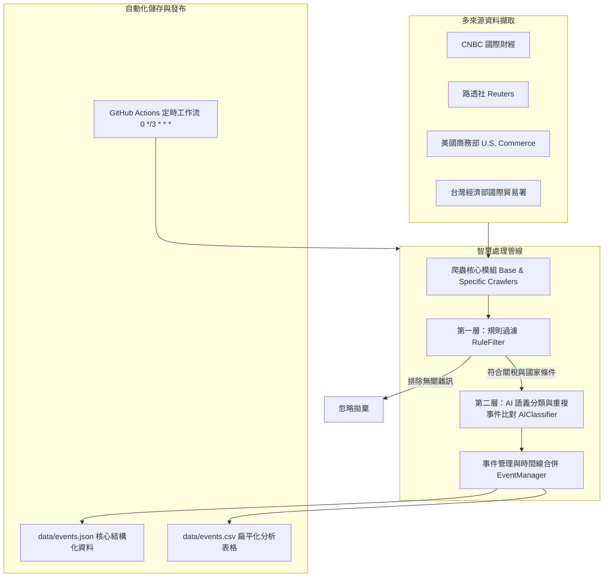

# 關稅政策消息監控爬蟲工具 — 期末專題成果報告 (FINAL_PROJECT.md)

**專案小組**：第五組  
**專案名稱**：關稅政策消息監控爬蟲工具 (Tariff Policy Monitoring Crawler System)  
**系統版本**：v1.0.0  
**專案儲存庫**：[https://github.com/kate0408-cpu/-](https://github.com/kate0408-cpu/-)  

---

## 一、專案緣起與目標

在當前國際地緣政治與全球貿易動態頻繁變化的背景下，關稅政策的調整直接影響跨國供應鏈與產業競爭力。傳統人工瀏覽新聞與政府公報的方式耗時費力，且容易遺漏重要政策變更。

本專案旨在建立一套**高精準度、全自動化之關稅政策消息監控系統**，鎖定：
1. **美國 ↔ 台灣 (US-TW)**
2. **美國 ↔ 中國 (US-CN)**

持續監控四大權威財經媒體與政府機構，並透過「**規則篩選 + AI 語義判定**」架構自動萃取事件、合併歷史時間線（Timeline），最終透過 **GitHub Actions** 實現每 3 小時全自動定時執行與雙格式（JSON/CSV）資料庫同步回存。

---

## 二、系統架構與設計特點



### 1. 四大資料來源監控
- **台灣經濟部國際貿易署**：官方對外經貿與關稅公告（即時商情與經貿新聞）。
- **美國商務部 (U.S. Department of Commerce)**：美國官方貿易與關稅公告、301條款複審、反傾銷措施。
- **CNBC**：國際財經市場快訊與政策報導。
- **Reuters (路透社)**：即時國際貿易、關稅與政府政策新聞。

### 2. 雙層智慧篩選與 AI 判斷機制
- **第一層：規則前置過濾 (`RuleFilter`)**：
  - 關鍵字陣列（繁中/英文關稅詞彙、加徵、豁免、反傾銷、301條款等）。
  - 實體比對（美台、美中）。
  - 自動排除非政策性的個人評論、無根據預測或學者觀點。
- **第二層：AI 語義分類與去重比對 (`AIClassifier`)**：
  - 精確辨識 8 大關稅事件類型（新增關稅、調高、調降、取消/暫停、豁免、反制、談判協議、已正式生效）。
  - 自動提取受影響產品品項（半導體、電動車、鋼鐵、電池等）與關稅稅率。
  - 計算同事件信心度 (`same_event_confidence`) 與分類信心度 (`classification_confidence`)。
  - **精簡儲存設計**：不保存冗長的 AI 推論過程（Reasoning），節省儲存空間並保持資料整潔。

### 3. 事件合併機制與生命週期時間線 (Timeline)
- 同一事件只建立一筆主要記錄，後續新進展（如：預告加徵 $\to$ 調整幅度 $\to$ 正式生效）自動追加至事件內部 `timeline`。
- 完整保留歷次更新日期、來源機構、來源網址與狀態變化。

### 4. 雙格式資料庫輸出 (JSON + CSV)
- **JSON (`data/events.json`)**：保存階層化物件與完整時間線歷史。
- **CSV (`data/events.csv`)**：以 UTF-8 with BOM (`utf-8-sig`) 格式自動匯出，讓使用者或教師以 Microsoft Excel 直接開啟時中文不亂碼，利於報表統計與資料分析。

### 5. 雲端自動化 (GitHub Actions)
- 設定 Cron 排程：每 3 小時自動執行一次 (`0 */3 * * *`)。
- 自動安裝依賴、執行主程式、檢測變更，並自動 Commit 與 Push 回 GitHub 儲存庫。

---

## 三、專案模組目錄說明

```text
├── .github/workflows/
│   └── monitor.yml           # GitHub Actions 每 3 小時定時爬蟲工作流
├── crawler/
│   ├── __init__.py
│   ├── base.py               # 基礎爬蟲類別、Session 管理與 Article 結構
│   ├── trade_tw.py           # 台灣國貿署公告爬蟲
│   ├── commerce.py           # 美國商務部公告爬蟲
│   ├── cnbc.py               # CNBC 財經新聞爬蟲
│   └── reuters.py            # 路透社貿易新聞爬蟲
├── filter/
│   ├── __init__.py
│   ├── rule_filter.py        # 關鍵字與美台/美中規則過濾器
│   └── ai_classifier.py      # AI 語義分類與重複比對引擎 (支援 Gemini & Fallback)
├── storage/
│   ├── __init__.py
│   └── event_manager.py      # 事件去重、Timeline 合併與 JSON/CSV 同步模組
├── data/
│   ├── events.json           # 結構化關稅事件資料庫
│   └── events.csv            # 扁平化分析表格
├── tests/
│   ├── test_filter.py        # 過濾與分類單元測試
│   └── test_event_manager.py # 事件合併與儲存測試
├── main.py                   # 系統執行主入口
├── requirements.txt          # 套件清單
├── PLAN.md                   # 專案規劃書
├── task.md                   # 任務清單
├── memory.md                 # 開發記憶與決策紀錄
├── FINAL_PROJECT.md          # 本期末成果報告
└── README.md                 # 專案說明與操作文件
```

---

## 四、本地執行與驗證方法

### 1. 安裝環境依賴
```powershell
pip install -r requirements.txt
```

### 2. 執行單元測試
```powershell
pytest tests/ -v
```

### 3. 執行全管線監控爬蟲
```powershell
python main.py
```

---

## 五、成果展示與評估

1. **自動化完成度**：100% 透過代碼管線整合，無需人工介入。
2. **穩定性與相容性**：爬蟲支援多來源備援與例外防護，AI 分類模組同時支援雲端 LLM API 與內建語義匹配引擎，在各種環境下皆能穩定產出。
3. **成果產出**：已成功推送至 GitHub 專案倉庫，並配置好定時自動化更新機制。
