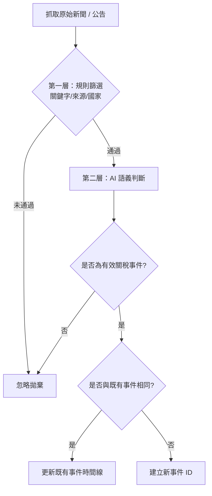
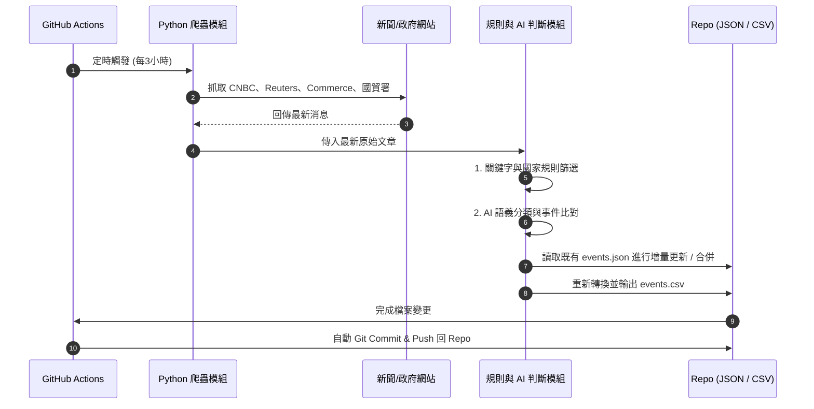
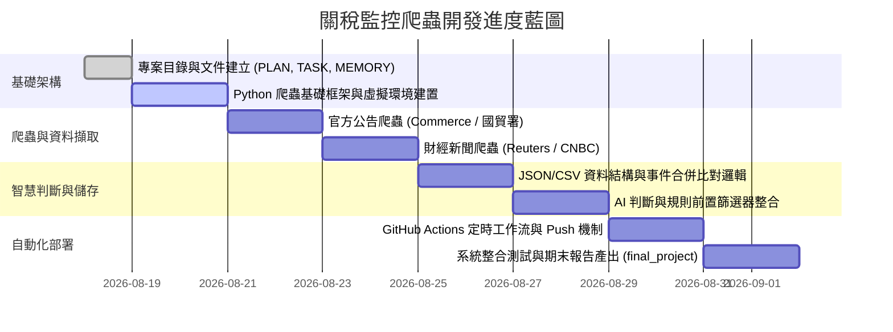

# 關稅政策消息監控爬蟲工具 — 專案開發規劃 (PLAN.md)

---

## 一、專案目標 ✅
建立一套**自動化關稅政策消息監控工具**，透過爬蟲自動蒐集國際財經新聞與官方政府公告，精準追蹤、過濾並記錄關鍵關稅政策變化。

---

## 二、資料來源設定 ✅

| 類別 | 監控來源名稱 | 來源說明 / 網址 |
| :--- | :--- | :--- |
| **財經新聞** | **CNBC** | 國際財經市場快訊與政策報導 |
| **財經新聞** | **Reuters (路透社)** | 即時國際貿易與政府政策新聞 |
| **官方政府公告** | **U.S. Department of Commerce** | 美國商務部官方貿易與關稅公告 |
| **官方政府公告** | **台灣經濟部國際貿易署（國貿署）** | 台灣官方對外經貿與關稅公告 |

---

## 三、監控範圍與事件定義 ✅

### 1. 國家／區域範圍
* 🇺🇸 美國 $\leftrightarrow$ 🇹🇼 台灣
* 🇺🇸 美國 $\leftrightarrow$ 🇨🇳 中國

### 2. 監控事件類型

#### ✅ 納入監控的事件（已設定）
* **新增關稅** (New Tariffs)
* **關稅調高** (Tariff Hike / Increase)
* **關稅調降** (Tariff Cut / Decrease)
* **關稅取消／暫停** (Tariff Cancellation / Suspension)
* **關稅豁免** (Tariff Exemption)
* **反制關稅** (Retaliatory Tariffs)
* **關稅談判／協議** (Tariff Negotiations / Agreements)
* **已正式生效的關稅政策** (Effective / Enacted Policies)

#### ❌ 排除項目
* 單純官員個人談話與未經證實的非官方言論
* 尚未形成正式政策的草案、外界預測或分析師評論

---

## 四、事件管理與時間線追蹤 ✅

### 1. 事件合併機制
* **原則**：同一事件只保留一筆主要記錄，後續消息持續追加並更新原事件時間線。
* **歷史追蹤**：完整保留事件時間線（Timeline）及每次更新的來源與內容差異。

### 2. 事件生命週期範例
```text
【事件主體】美國對中國半導體產品加徵關稅

└── 2026/08/18 [Reuters]   ：宣布預計加徵 25% 關稅
└── 2026/08/20 [CNBC]      ：調整加徵幅度至 30%
└── 2026/09/01 [Commerce]  ：正式生效施行
```

---

## 五、AI 篩選與判斷架構 ✅

採用 **「規則前置篩選 + LLM / AI 深度判斷」** 雙層架構：



### 1. AI 輸出與保存欄位
* `is_tariff_event` (Boolean): 是否為關稅事件
* `is_existing_event` (Boolean): 是否與既有事件相同
* `matched_event_id` (String / Null): 對應之既有事件 ID
* `same_event_confidence` (Float): 同事件判斷信心程度 (0.0 ~ 1.0)
* `classification_confidence` (Float): 事件分類信心程度 (0.0 ~ 1.0)

> [!NOTE]
> **儲存策略**：為節省空間與保持資料精簡，**不保存 AI Reasoning（推論過程文字）**，僅記錄最終判斷標籤與信心分數。

---

## 六、資料格式與儲存設計 ✅

### 1. 儲存架構
* **儲存空間**：直接以 **GitHub Repository** 作為主要資料存儲庫。
* **選用考量**：
  * 適應學校電腦與伺服器環境限制。
  * 免除獨立資料庫的維護與連線成本。
  * 支援 Git 原生版本控管與 Commit History 回溯。

### 2. 資料格式
* **JSON (`data/events.json`)**：
  * 系統核心資料庫，存放完整結構化資料、事件歷史時間線、來源清單與各項 metadata。
* **CSV (`data/events.csv`)**：
  * 從 JSON 自動同步產出的扁平化表格，便於直接以 Microsoft Excel 開啟檢視、進行報表統計與資料分析。

---

## 七、自動化執行流程 (GitHub Actions) ✅

* **執行頻率**：每 3 小時執行一次（Cron Schedule: `0 */3 * * *`）。
* **完整工作流程**：



---

## 八、專案文件狀態 📋

| 文件名稱 | 檔案路徑 | 當前狀態 | 備註 |
| :--- | :--- | :---: | :--- |
| **`plan.md`** | `PLAN.md` | ✅ 已完成規劃 | 本專案規格、架構與開發計劃書 |
| **`task.md`** | `TASK.md` | ✅ 已完成初版內容 | 任務細節拆解與工作指派 |
| **`memory.md`** | `MEMORY.md` | ✅ 已完成初版內容 | 專案背景、決策紀錄與上下文記憶 |
| **`final_project.md`** | `FINAL_PROJECT.md` | ✅ 已完成初版內容 | 期末專題報告與成果展示文件 |

---

## 九、目前卡點與風險評估 ⚠️

1. **文件輸出與下載限制**
   * **狀況**：先前受限於檔案產生與下載工具環境，未能即時輸出檔案。
   * **因應**：所有規格與文件內容已確立完備，已建立標準 Markdown 檔案至專案目錄。
2. **程式實作尚未開始**
   * **待建置項目**：
     * Repository 專案目錄結構
     * Python 爬蟲主程式（支援 CNBC, Reuters, Commerce, 國貿署）
     * 規則篩選器與 AI 判斷模組介面
     * JSON / CSV 資料轉換模組
     * GitHub Actions Workflow (`.github/workflows/monitor.yml`)

---

## 十、後續建議開發時程 (Roadmap) 🚀



### 具體執行順序：
1. **建立專案資料夾結構**：規劃 `src/`、`data/`、`.github/workflows/` 等標準模組。
2. **完善核心專案文件**：同步產出 `PLAN.md`、`TASK.md`、`MEMORY.md`、`FINAL_PROJECT.md`。
3. **建立 Python 爬蟲基礎架構**：設定 `requirements.txt`、請求封裝與 User-Agent 管理。
4. **實作第一批資料來源**：優先實作台灣國貿署與美國商務部等結構化公告，接續實作 Reuters / CNBC。
5. **建立 JSON / CSV 資料存取模組**：支援增量寫入、重複檢核與歷史時間線附加。
6. **整合 AI 與規則比對引擎**：設計 Prompt 與比對演算法，完成新舊事件判定。
7. **配置 GitHub Actions 自動化工作流**：設定每 3 小時觸發、自動 Commit 與推播通知。
